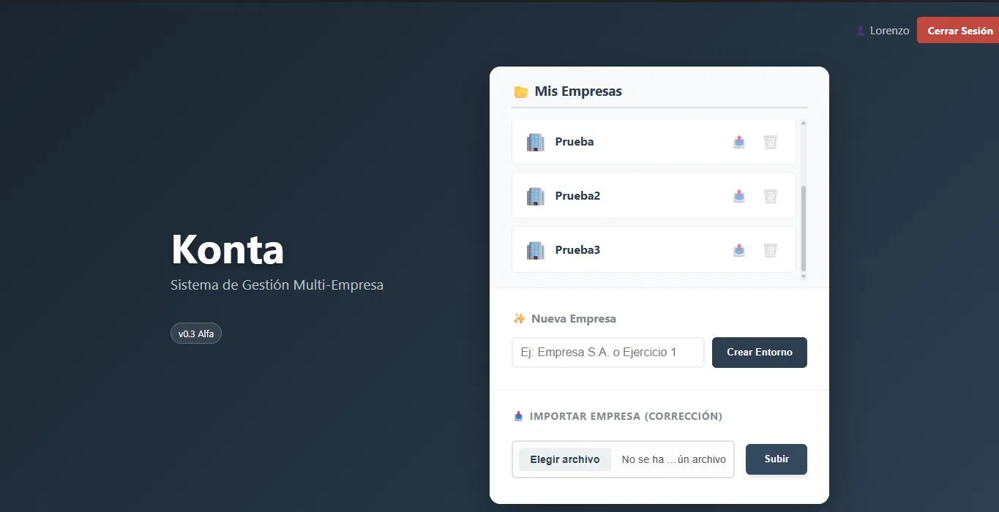
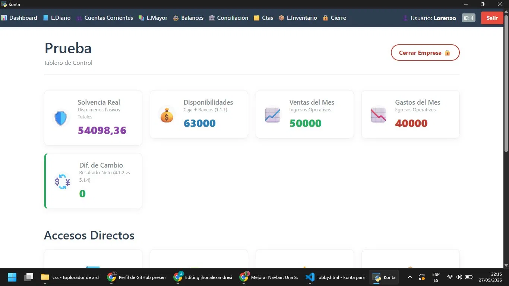
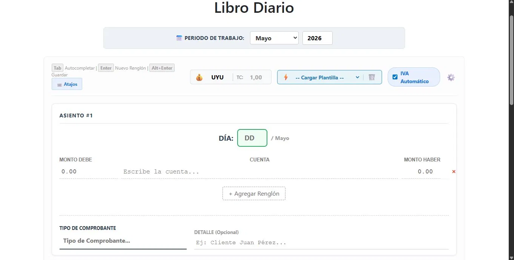
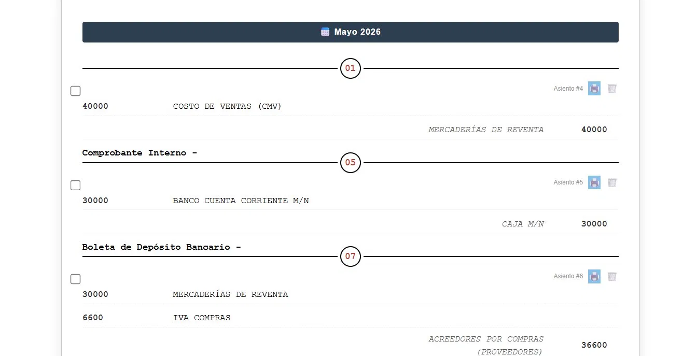
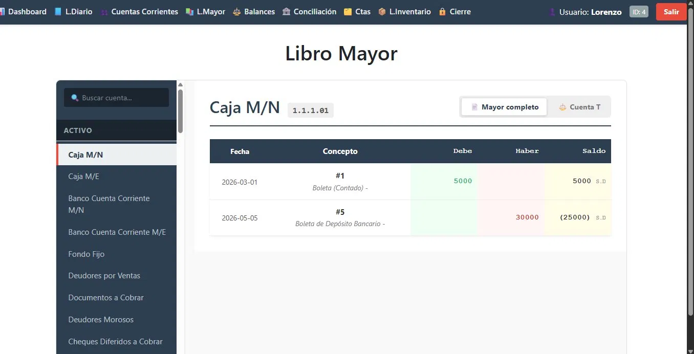
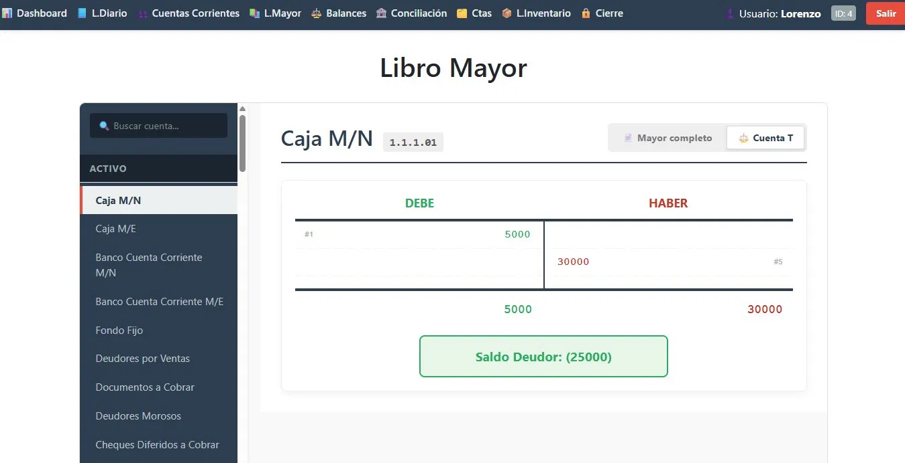
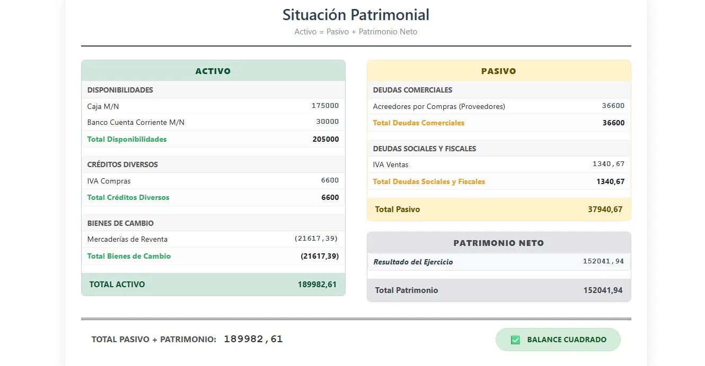
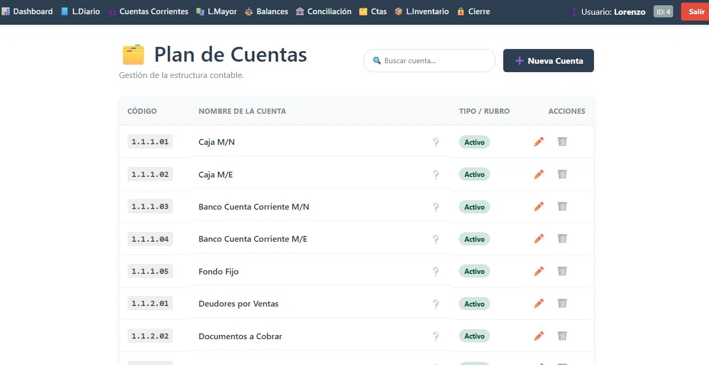

# 📒 Konta — Sistema Contable Web

> 🚧 **Versión v0.3 Alfa — en desarrollo activo.**  
> El proyecto está funcional pero incompleto. Se van agregando módulos y mejoras continuamente.

Konta es una aplicación web de contabilidad construida con Python y Flask. El objetivo es que el usuario registre sus operaciones en el libro diario y la app genere automáticamente todos los informes financieros: libro mayor, balances y situación patrimonial.

---

## 🖼️ Capturas

### Lobby — Gestión Multi-Empresa
Cada empresa es un entorno independiente con su propia información contable.



---

### Dashboard — Tablero de Control
Vista rápida de los indicadores clave: solvencia, disponibilidades, ventas y gastos del mes.



---

### Libro Diario — Registro de Operaciones
Ingreso de asientos contables con debe, haber y tipo de comprobante. Incluye IVA automático y plantillas reutilizables.



---

### Libro Diario — Vista Cronológica
Visualización de los asientos registrados en formato cronológico, tal como aparecerían en un cuaderno contable.



---

### Libro Mayor — Generado Automáticamente
A partir de los registros del libro diario, Konta construye el libro mayor de cada cuenta con fecha, concepto, debe, haber y saldo.



---

### Libro Mayor — Cuenta T
Vista alternativa en formato de cuenta T, con saldo deudor o acreedor calculado automáticamente.



---

### Situación Patrimonial — Balance Automático
El informe más importante: Activo = Pasivo + Patrimonio Neto, generado a partir de todas las registraciones. Konta verifica que el balance cuadre.



---

### Plan de Cuentas — Personalizable
El usuario puede crear, editar y organizar sus propias cuentas contables según sus necesidades.



---

## ✨ Funcionalidades actuales

- 🏢 **Multi-empresa** — cada entorno es completamente independiente
- 📝 **Libro Diario** con IVA automático, plantillas y múltiples asientos
- 📖 **Libro Mayor** generado automáticamente (vista completa y cuenta T)
- ⚖️ **Situación Patrimonial** con verificación de balance cuadrado
- 📈 **Estado de Resultados** generado automáticamente
- 📦 **Stock / Inventario** con valuación por LIFO, FIFO y PMP
- 🏦 **Conciliación Bancaria**
- 📊 **Dashboard** con indicadores financieros clave
- 📋 **Plan de Cuentas** personalizable
- 👤 **Sistema de usuarios** con sesiones independientes

---

## 🗺️ Lo que viene

- [ ] Módulo de Proveedores
- [ ] Dashboard mejorado con gráficas
- [ ] Más formas de registración en el libro diario
- [ ] Demo online
- [ ] Correciòn de errores en el funcionamiento de ciertas funciones

---

## 🛠️ Stack

<div align="center">


</div>

---

## 🚀 Correr localmente

```bash
git clone https://github.com/jhonalexandresilvasolis-ops/Konta.git
cd Konta
pip install -r requirements.txt
cp .env.example .env   # completá las variables de entorno
python app.py
```

Abrí `http://localhost:5000` en tu navegador.

---

Todavía hay mucho por hacer — pero el núcleo funciona, los balances cuadran, y cada commit lo deja un poco mejor.
